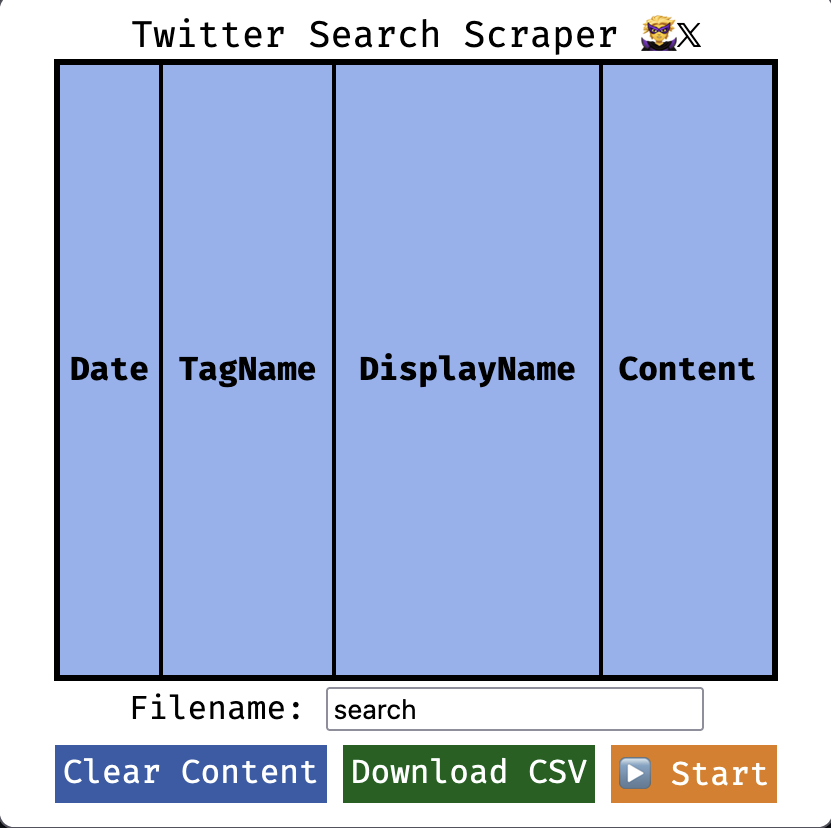
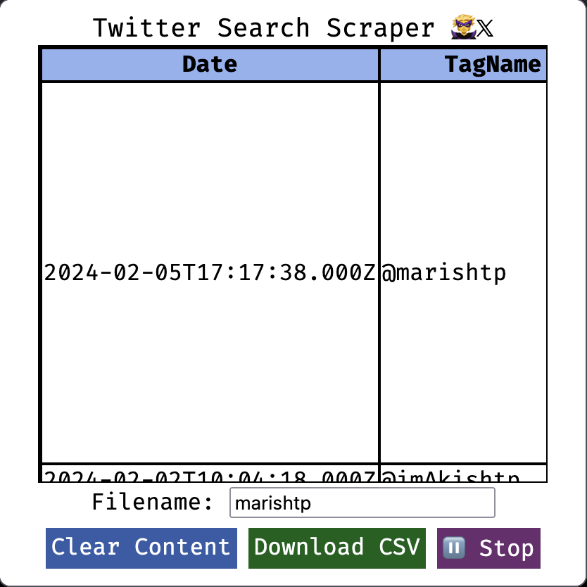

# Twitter Web Scraper (TWS)

A twitter search scraper in the form of a browser extension.

## Documentation

## Firefox

TWS was designed for Firefox and hence provides very good support

## Chrome

TWS was not designed specifically for chrome but it is now.

to add to chrome folow these steps:

- Download [Archive.zip](https://github.com/mohamedarish/tws/releases/download/chromev0.1/Archive.zip)
- Unzip the package
- Go to [chrome://extensions/](chrome://extensions/) on your chromium based browser of choice
- Enable developer mode
- Load unpacked extension
- Select the folder that we just unzipped

Now the extension has loaded.

- (Optional) Pin the extension for easier use! :)
